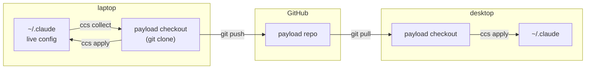

# dazzle-claude-config

[](https://pypi.org/project/dazzle-claude-config/)
[](https://github.com/DazzleML/dazzle-claude-config/releases)
[](https://www.python.org/downloads/)
[](https://www.gnu.org/licenses/gpl-3.0.html)
[](https://dazzleml.github.io/dazzle-claude-config/stats/#installs)
[](docs/platforms.md)

**Git-backed sync for your Claude Code configuration (skills, commands, agents, hooks, and `CLAUDE.md`) across every machine you work on, with credential protection on the way in and backups on every write.**

## The Problem

Your Claude Code setup is earned. Skills you refined over months, commands that encode how you actually work, a `CLAUDE.md` tuned by a hundred small corrections. All of it lives in `~/.claude` on **one** machine.

Then you get a laptop. Or a work box. Or you reinstall. So you copy the folder by hand -- and now the two drift apart, silently, because there is nothing to tell you which one is newer. Worse, `~/.claude` is not only config: it also holds `.credentials.json`, OAuth state, plugin caches, and session databases. Copy it wholesale into a git repo to "back it up" and you have published an API key. There is no history either, so when a config change makes Claude behave oddly, there is nothing to diff and nothing to roll back to.

**ccs** treats your configuration as a git repository, a *payload* if you will, and moves files between that repo's checkout and your live `~/.claude`. `collect` copies a live config in, refusing credentials rather than trusting you to notice them. `apply` copies config back out, backing up every file it overwrites. When a file changed on *both* machines, neither direction is safe -- so `merge` opens your own diff tool (Beyond Compare, vimdiff, WinMerge, whatever git already knows) with both versions and a common ancestor, and installs nothing until the result is checked for content that went missing. Because a payload is just a repo, it can be yours, someone else's, or a fork of theirs.

> [!NOTE]
> **Alpha (as of v0.4.0) -- working, in daily use, surfaces not frozen.** It manages my own configs across machines. The core loop (`collect` / `apply` / `merge` / `status` / `diff`, deny-list + credential scanning, backups, staged removals, selective sync) are functional; the Phase 2 set (templated settings rendering, declarative plugin installs, and one-command `ccs bootstrap` onboarding) is still a WIP, and command surfaces may change between versions until it does. `merge` resolves against a common ancestor when one can be trusted and says so plainly when it cannot; AI-assisted resolution is stubbed but not yet implemented. Please [file issues](https://github.com/DazzleML/dazzle-claude-config/issues) for anything rough. And, as with any sync tool, keep an independent copy of anything irreplaceable.

Part of the DazzleML Claude toolchain: [session-logger](https://github.com/DazzleML/claude-session-logger) records, [claude-session-backup](https://github.com/DazzleML/Claude-Session-Backup) preserves, **ccs distributes**.

## Quick Start

```bash
pip install dazzle-claude-config          # installs `ccs` (alias: dazzle-claude-config)
```

Python 3.10+, stdlib only, git is the sole external dependency.

**Try a config without committing to one.** [dazzle-claude-code-config](https://github.com/DazzleML/dazzle-claude-code-config) is a public collection (skills, commands, and agents for structured design analysis, postmortems, human test checklists, and multi-agent consultation) and it is a working payload repo you can point ccs at right now:

```bash
git clone https://github.com/DazzleML/dazzle-claude-code-config ~/claude/dazzle-config

ccs status --checkout-dir ~/claude/dazzle-config   # what differs? nothing is touched
ccs diff   --checkout-dir ~/claude/dazzle-config   # which files, exactly?

ccs apply --only dotclaude/skills --checkout-dir ~/claude/dazzle-config   # a slice...
ccs apply --checkout-dir ~/claude/dazzle-config                          # ...or the lot
```

`--only` takes a prefix of the path *inside the repo* (the left-hand paths `ccs diff` prints) which is why it reads `dotclaude/skills` rather than `skills`. A prefix matching nothing warns rather than silently doing nothing. For one file there is a shorter spelling: `ccs apply think/SKILL.md` (and `merge`, `collect`) takes a path the way `ccs diff <path>` does and scopes the verb to it, listing the candidates if more than one file matches.

`apply` merges into your live config rather than replacing it, backs up anything it overwrites, and treats `CLAUDE.md` as seed-if-absent (so your own memory file is never clobbered). Fork it if you want to build on it; it is designed to be forked.

**Already have your own config repo:**

```bash
git clone <your-payload-repo> ~/claude/my-config
ccs status --checkout-dir ~/claude/my-config
ccs apply  --checkout-dir ~/claude/my-config
```

**Starting from the config you already have on this machine** -- see [Turning your current config into a payload](#turning-your-current-config-into-a-payload) for the four commands that package `~/.claude` into a repo.

Then, day to day:

```bash
git -C <checkout> pull        # what your other machines sent (ccs status says when this is due)
ccs status                    # what differs, and which side owns each change
ccs merge                     # files that changed on BOTH sides -- your diff tool decides
ccs apply                     # the rest: checkout INTO the live tree (originals backed up)
#   ... work ...
ccs collect                   # live config INTO the checkout (credentials refused)
git -C <checkout> commit -am "config: ..." && git push
```

`apply` and `collect` are one-way copies, so they **refuse** a file that changed on both sides rather than picking a winner (that is what `merge` is for) and each **skips** a file the other verb owns (live ahead: nothing to apply; checkout ahead: nothing to collect), saying why. `ccs status --long` shows which commit each side still equals, so the call is checkable, and `ccs diff <path> --difftool 3` shows that commit as the middle pane of your merge tool. Steps 1 and 6 are plain git; ccs does not wrap them.

A machine whose file forked *before* the payload existed has no ancestor in the checkout. `ccs merge --only <entry/file> --base-from <repo>:<path> --dry-run` reads one out of another repository and prints what a merge against it would let go of (the number to read is `lost`; it must be 0); the same command without `--dry-run`, then with `--accept`, merges **conflict-on-delete** (every section the payload removed that this box still carries becomes a hunk for you to decide, not a silent drop) and installs the result into the live file only, leaving the checkout alone. 

**[Merging, walked through](docs/merge.md)** covers the three sides, reading the dry-run table and the receipt, finding the ancestor, and merging on a box with no GUI; **[a three-way merge, if you have never done one](docs/three-way-merge.md)** is the ten-minute primer on the tool window itself.

`ccs merge <path> --ai` asks a model to resolve the hunks both sides changed. It writes its answer to a **second file beside yours** and installs nothing: the model may only select whole lines out of the panes it was shown, under rules you write in your own words, and a proposal that invents a line or drops one without citing a rule is refused before you ever see it. The default backend is `prompt-only`, which writes the prompt and sends nothing anywhere. **[Asking a model to resolve the hunks](docs/ai-merge.md)** is the whole feature: the rules file, the ancestry the model is told, what the check enforces, and what `--accept` asks before installing a proposal you have not read.

Here is: **[the full loop, step by step, with what each step guarantees](docs/sync-loop.md)** and **[ccs walked through end to end](docs/walkthrough.md)**: a first machine from nothing, the `CLAUDE.md` choice, a second machine, and a box that forked before the payload existed, with an observable outcome at every step so the page doubles as a test.

## Usage

When you upgrade ccs, **`ccs setup update`** teaches your `~/claude/ccs-config.json` the settings the new version knows, adding each at its documented default. It is additive and nothing else: a value you set is never changed (not even one that happens to equal the default) your keys keep their positions with the new ones appended after them, and a key this version does not recognise is reported and left exactly where it is, because it usually means a newer ccs wrote the file. `--dry-run` prints precisely what it would add and writes nothing. A file it cannot parse is never written over: it says so and names what to do. This matters more than it sounds -- without it a config file silently describes an older tool than the one you are running, and a setting introduced in a later release governs your machine without ever appearing in the file you would look at to understand why.

On a machine that is not configured yet, two verbs work before anything else does: `ccs setup box` declares the machine's identity (the name and tags that decide which entries apply here -- it never overwrites an existing declaration), and `ccs doctor` checks the whole environment read-only, pairing every finding with the command that fixes it. Seeded files -- delivered once, then yours -- get an explicit ownership story: bare `ccs seed` walks every open question one keystroke at a time (keep mine / take the payload's / open both in my diff tool), `ccs seed keep <file>` records "keep mine" (asked again only if the payload's seed changes), and `ccs seed migrate <file>` takes the payload's newer version the safe way -- it keeps a copy of yours outside the backup tree, installs theirs, then proves both copies still hold your original bytes.

`ccs status` answers "am I in sync?" across all three legs -- your live config vs the checkout, the checkout vs its remote, and any uncommitted work in the checkout:

```
remote    github.com/you/your-config-payload: main, in sync
checkout  ~/claude/dazzle-claude-code-config  (on main)
compared  83 files across 11 entries of config
          ~/.claude
          ~/claude

protected (1 file kept out of sync on purpose -- matches a deny rule, so ccs will not copy it in either direction)
  bin/gpg-loopback.sh

status: clean -- everything ccs syncs matches; nothing to collect, nothing to apply
```

Output is colorized on a TTY (and plain when piped, or with `--no-color` / `NO_COLOR`).

`clean` is a claim about all three legs, not just the first two. If the checkout holds commits the remote does not, the summary says so and names `ccs git push` rather than calling the machine clean -- work that exists on exactly one disk is the state least worth staying quiet about. Behind, it names `ccs status --pull`; diverged, it says so and points at the checkout, because a fast-forward cannot help once both sides have moved.

`ccs status --long` labels each differing file with which side moved, and how sure it is. `one-sided` means one side changed and the other still matches a commit -- safe to copy in that direction. `two-sided` means both moved, so neither verb is safe and `merge` is the answer. **`unattributed`** means ccs will not say: the file's history points one way, but the side it points at holds no lines the other side lacks, which is more consistent with that side being stale than ahead. The entry above such a file reads `direction unproven` rather than claiming everything under it is one-sided. In that case ccs names `ccs diff` -- which only reads -- instead of a verb that writes, because an honest "I cannot tell" is worth more than a confident wrong direction.

`collect` and `apply` both support `--dry-run`, `--only <prefix>`, and one file as a positional (`ccs apply think/SKILL.md`). Options work before or after the verb.

When the payload **retires** a file -- deletes it deliberately -- your machine still has its copy, and what should happen depends on whether that copy is still yours. `sync_removals` in `~/claude/ccs-config.json` decides: `untouched` (the default) moves a retired file into the backup directory only when your copy still matches a committed version, so a copy you edited is reported and kept instead; `all` stages every retired file; `never` only reports. `--sync-removals` and `--no-sync-removals` override it for one run in either direction. Nothing is ever deleted in place -- a removal is a move into the backup directory. Retired files are never staged automatically from a checkout that is detached or behind its remote, because on a stale tree everything added since looks retired.

`ccs setup update --explain <setting>` says what any setting means -- its default, its valid values, and the environment variable that sets it. The words ship inside ccs, so it answers on a headless box over SSH with no browser, no network and no config file yet; it writes nothing. With no setting named it lists them all in brief and points at the full reference, offering to print everything in your terminal instead -- and when you redirect or pipe it, you get everything without being asked. **[Every setting, in one page](docs/configuration.md)** is generated from the same words the tool prints, so the two cannot disagree.

`apply` will also stop putting back a file you removed on purpose, once you say so: `ccs apply --keep-deleted <path>` records that in `~/claude/ccs-deleted.json`, and `--restore-deleted <path>` undoes it. ccs cannot work this out for itself -- a file present in the payload and absent from your machine looks the same whether you deleted it or it never arrived -- so it asks rather than guessing, and tells you when it installs something your live config did not have.

Sharing the checkout is plain git, and `ccs git ...` passes any git command straight through to it from wherever you are -- `ccs git push`, `ccs git pull`, `ccs git log --oneline` -- so you never have to `cd` to the payload to push what you just collected. If you would rather not think about it, set `"auto_pull": true` in `~/claude/ccs-config.json` and `ccs status` fast-forwards the checkout itself before comparing, using the fetch it already ran; it only ever fast-forwards, so a diverged branch or a file in the way makes it stop and tell you rather than merge on your behalf. `ccs status --pull` does the same thing once, without changing the setting.

`collect` will not overwrite a file you have edited in the checkout but not committed. That work exists in no commit and on no other machine, so it refuses that one file, names the three ways forward (commit it, `git checkout --` it, or `--force`), collects everything else, and exits nonzero.

### Sending part of a config, and not sending the rest

`--only` scopes a run to one slice, which matters most when the checkout is a repo you *publish*. There a `collect` does not merely copy a file, it stages it for the world, and the risk is not the file you meant to send but the one you forgot you had.

Two settings in `ccs-manifest.json` cover that, and they do different jobs:

```jsonc
"collect_exclude": ["commands/t-*.md"],  // never syncs, either direction
"hold_additions": true                   // update tracked files; do not add new ones
```

`collect_exclude` names content you already know must stay out. `hold_additions` guards the file you *haven't* thought of: with it set, `collect` updates what the checkout already tracks but will not create anything new without `--add`, and it names everything it held back. An exclusion list is a promise someone has to keep current; this is not.

It defaults to off, so a private payload you sync with yourself behaves as it always has. The first `collect` against an entry the checkout carries nothing for is treated as adoption and its files are added regardless -- otherwise a first run would be a silent no-op.

### Files that belong to one machine

Some files are one box's own: its operating manual, a hook only it runs. An entry can say so with `tags`, and each box declares what it is in `~/claude/ccs-box.json`:

```jsonc
// ccs-manifest.json
{"repo": "machines/prod-vps/machine.md", "territory": "userclaude",
 "target": "claude-config/machine.md", "strategy": "copy", "tags": ["prod-vps"]}

// ~/claude/ccs-box.json, on that box only
{"name": "prod-vps", "tags": ["prod-vps", "production"]}
```

The entry applies only where **every** tag it names is declared, and the same rule gates `collect`, so a box without the tag cannot stage the file into the shared checkout by accident. Tags are names you choose, not hostnames. No box file means no tags, which switches tagged entries *off*; `ccs status --long` lists what the gate kept off this box and why. The older `os` key (`windows` / `posix`) works the same way for platform files, and the two combine.

## Where things live

ccs moves files between exactly three locations. The distinction that matters: **your live config is what Claude Code reads; the checkout is a git clone that Claude Code never looks at.**

| | Default location | Who reads it | How to point elsewhere |
|---|---|---|---|
| **Live config** | `~/.claude` | Claude Code, every session | `CLAUDE_CONFIG_DIR` env, or `--claude-dir` |
| **User territory** | `~/claude` | you -- notes, backups, and where checkouts land | `--user-claude` |
| **Payload checkout** | `~/claude/dazzle-claude-code-config` | ccs and git -- **not** Claude Code | `CCS_CHECKOUT_DIR` env, or `--checkout-dir` |

The **payload checkout** is an ordinary `git clone` of a *config payload repo*: a repository whose contents are skills, commands, agents, hooks, and a `CLAUDE.md`. Editing files there changes nothing until you run `ccs apply`. That indirection is the whole point. It gives your config a place to be versioned, reviewed, conflict-resolved, and shared, without a half-finished edit reaching a live session.



ccs owns the vertical hops (live ↔ checkout, guarded and backed up). Git owns the horizontal ones (checkout ↔ GitHub ↔ your other machines). No merge logic lives in ccs -- a conflict between two machines is an ordinary git conflict you resolve in the checkout with your normal tools.

### Turning your current config into a payload

You already have a `~/.claude` full of work. To package it:

```bash
gh repo create my-claude-config --private          # or make the repo in the web UI
git clone <that repo> ~/claude/my-config
cd ~/claude/my-config

mkdir skills commands agents                       # the surfaces you want tracked
touch CLAUDE.md                                    # only if you want your memory synced

ccs collect --checkout-dir ~/claude/my-config      # copies your live config in, guarded
git add -A && git commit -m "my config" && git push
```

The empty directories are how you say *what* to track: `collect` fills in each surface you created and ignores the ones you didn't. Nothing is copied blind -- the deny-list and credential scan run on the way in, and anything refused is reported rather than silently skipped, so `.credentials.json`, `settings.local.json`, plugin state, and any file containing a credential-shaped token stay out of the repo. Read the `collect` output before you commit; it is the last cheap moment to notice a surprise.

Run `ccs collect` from then on whenever you change your live config, and commit. There is no manifest to write unless you want one -- the implicit layout above is enough for most people.

### Whose config is in the checkout?

Any repo that holds config. That is the interesting part:

- **Your own** (the main use case) -- a private repo you push from one machine and pull on the next. Your config follows you.
- **Someone else's, read-only** -- point a checkout at a public collection such as [dazzle-claude-code-config](https://github.com/DazzleML/dazzle-claude-code-config) and `ccs apply` to try the "Dazzle" skills collection. `--only <prefix>` takes a slice instead of everything.
- **A fork of someone else's** -- start from a collection you like, then `ccs collect` your own changes on top and push to your fork. Theirs becomes yours, and you can still pull their updates.

Nothing stops you keeping several checkouts side by side and pointing ccs at whichever you want, as they are just directories:

```bash
ccs diff  --checkout-dir ~/claude/someones-collection                  # what would change?
ccs apply --checkout-dir ~/claude/someones-collection --only skills/   # borrow just their skills
ccs status --checkout-dir ~/claude/my-config                           # back to yours
```

`apply` copies *into* your live tree rather than swapping it, so borrowing from a second collection merges on top of what you have (originals backed up first, as always). Named profiles with a single active set -- `ccs use <name>` -- are a [tracked idea](https://github.com/DazzleML/dazzle-claude-config/issues/8), not a current feature; today, `--only` plus your own payload as the source of truth is the way to stay in control.

Set the one you use daily and stop typing the flag:

```bash
export CCS_CHECKOUT_DIR=~/claude/my-config     # POSIX (add to your shell profile)
setx CCS_CHECKOUT_DIR C:\src\my-config         # Windows (applies to new shells)
```

Precedence: `--checkout-dir` > `CCS_CHECKOUT_DIR` > the default above.

A payload repo needs no special structure. If it has a `ccs-manifest.json`, that file declares exactly what syncs where. If it does not, ccs treats a repo that *looks like* a `~/.claude` directory (root-level `CLAUDE.md`, `skills/`, `commands/`, `agents/`...) as one -- so a repo someone made by pushing their config folder as-is just works.

## How it works

- **Manifest-driven allowlist**: the payload repo's `ccs-manifest.json` declares what syncs where (territories, per-entry strategy: `copy`, `seed-if-absent`, `render`, `plugins`). Nothing outside the manifest ever moves.
- **Secrets are structurally fenced**: a hard deny-list (`.credentials.json`, `.claude.json`, `settings.local.json`, databases, plugin caches...) refuses files even if listed, and collect scans content for credential shapes (`sk-ant-`, `ghp_`, AWS keys, private-key headers...) -- refusals are reported, never silent.
- **Git is the merge arena**: multi-machine conflicts are ordinary git conflicts in the checkout; `apply` refuses while conflicts are unresolved. `ccs` contains no merge logic and exposes no branch operations.
- **The home repo is untouchable**: if your home directory is itself a git repository (e.g. managed by claude-session-backup), `ccs` structurally refuses to operate on it.
- **Nothing is destroyed**: every overwrite is preceded by a timestamped backup under `~/claude/backups/ccs/`; removals are staged there, never deleted in place.
- **Index verification**: files copied into the checkout are checked against git's ignore/exclude mechanism, so a machine-level exclude can never silently drop config from the payload.

## Roadmap

`render` (templated settings with per-OS/per-machine overlays), declarative plugin install, and `ccs bootstrap <payload-url>` (one-command machine onboarding) land in Phase 2 -- see the pinned [Roadmap issue](https://github.com/DazzleML/dazzle-claude-config/issues/4).

## Contributing

Contributions welcome! Please open an issue or submit a pull request.

See **[CONTRIBUTING.md](CONTRIBUTING.md)** for:
- Development setup (`pip install -e ".[dev]"`)
- Running the test suite and human test checklists (`tests/checklists/`)
- Version management with `sync-versions.py`
- Pull request checklist

Like the project?

[](https://www.buymeacoffee.com/djdarcy)

## Related Projects

- [dazzle-claude-code-config](https://github.com/DazzleML/dazzle-claude-code-config) - A public collection of Claude Code skills, commands, agents, and settings -- a ready-made payload repo to point ccs at, or fork as your own
- [claude-session-logger](https://github.com/DazzleML/claude-session-logger) - Real-time per-session tool/conversation logging; its session naming and state-file conventions are part of the config surface ccs syncs
- [claude-session-backup](https://github.com/DazzleML/Claude-Session-Backup) - Backs up and restores Claude Code session history; the preservation half of the toolchain ccs distributes into

## License

dazzle-claude-config, Copyright (C) 2026 Dustin Darcy

Licensed under the [GNU General Public License v3.0](https://www.gnu.org/licenses/gpl-3.0.html) (GPL-3.0) -- see [LICENSE](LICENSE)
